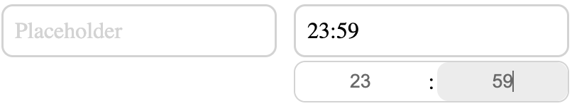

# Vue 3 Simple Timepicker

Timepicker library for Vue 3.



## How to Use
Add a dependency to your application:
```bash
npm i vue3-simple-timepicker
```
Import the styles and use the component:
```vue
<script setup>
import { SimpleTimepicker } from 'vue3-simple-timepicker';
import 'vue3-simple-timepicker/style.css';
</script>

<template>
    <SimpleTimepicker placeholder="Placeholder" v-model="value" />
</template>
```

## Props

```typescript
{ 
    /** Placeholder */
    placeholder?: string,
}
```

## Styles Customization
You can change the global styles of the component. The basic styles are located [here](./src/style.css).
